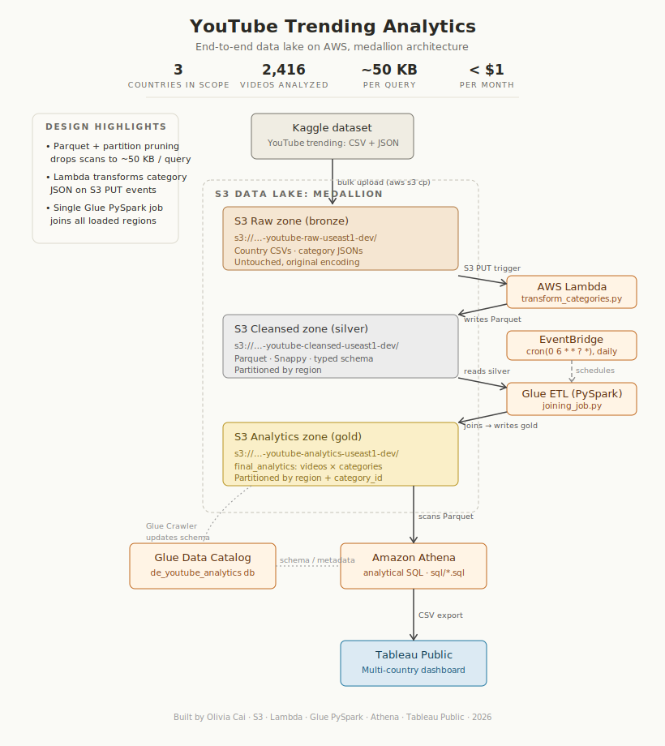

# YouTube Trending Analytics: End-to-End AWS Data Lake

An S3 medallion data lake processing Kaggle YouTube trending data through Lambda, Glue PySpark, Athena, and Tableau, all for under $1/month.

This project implements the end-to-end reference pipeline from Darshil Parmar's two-part tutorial ([Part 1](https://www.youtube.com/watch?v=yZKJFKu49Dk), [Part 2](https://www.youtube.com/watch?v=qFaaKme5eDE)). The Lambda function (`transform_categories.py`), the Glue PySpark job (`joining_job.py`), and the medallion bucket-zone layout were followed directly from that tutorial. The architecture diagram (`docs/architecture.svg`), the four Athena SQL queries in `sql/`, the Tableau Public dashboard, and the analytical writeup (`docs/analysis.md`) are my original work.

## Architecture



## TL;DR

Built a daily-batch AWS data lake that lands Kaggle YouTube trending data in S3, normalizes category lookups with Lambda, joins regional video snapshots with PySpark on Glue, catalogs the result, and serves it to Athena and Tableau Public. Stack: S3, Lambda, Glue, Glue Data Catalog, Athena, Tableau. The published dashboard analyzes 2,416 trending videos across US, GB, and CA (1.77B total views, 2.79% average engagement rate), at a measured cost of under $1/month on my AWS account, with each Athena query scanning roughly 1–5 MB of Parquet.

## Data source

The [Kaggle YouTube Trending Video Dataset](https://www.kaggle.com/datasets/datasnaek/youtube-new) ships one CSV per country containing daily trending-video snapshots (video_id, title, channel, publish time, views, likes, dislikes, comments, etc.) and a matching per-country category JSON lookup file. The full dataset covers 10 countries; this project scopes the dashboard to a focused **three-country lens of US, GB, and CA** to keep the comparative analysis legible while still exercising the multi-region partitioning end to end.

## Pipeline

- **Ingestion.** Raw Kaggle files are bulk-uploaded into the raw bucket with a manual `aws s3 cp --recursive` into `s3://<prefix>-youtube-raw-useast1-dev/`.
- **Category transform.** `transform_categories.py` (AWS Lambda, *from tutorial*) is triggered by an S3 PUT event on each category JSON, flattens the nested `items[]` array, and writes normalized Parquet into `s3://<prefix>-youtube-cleansed-useast1-dev/` (the silver zone).
- **Join.** `joining_job.py` (AWS Glue PySpark, *from tutorial*) reads the silver Parquet partitioned by region, joins video snapshots against the category lookup, and writes the gold `final_analytics` dataset to `s3://<prefix>-youtube-analytics-useast1-dev/`, partitioned by `region` and `category_id`.
- **Catalog.** An AWS Glue Crawler registers and refreshes the schema in the `de_youtube_analytics` Glue Data Catalog database; the gold table is `final_analytics`.
- **Query.** Amazon Athena reads the catalog via the four SQL files in `sql/`.
- **Visualize.** Tableau Public consumes Athena CSV exports to drive the [three-country lens dashboard](https://public.tableau.com/views/youtube-trending-three-country-lens/Dashboard1).

## Data modeling and partitioning

The lake follows a three-zone medallion layout: **raw** (immutable Kaggle CSV + JSON), **cleansed/silver** (normalized Parquet, partitioned by `region`), and **analytics/gold** (`final_analytics`, partitioned by `region` + `category_id`). Partitioning on `region` first matches the natural query pattern (every dashboard view filters or facets by country), and the secondary `category_id` partition keeps the per-category heatmap query down to single-digit MB scans.

One semantic nuance worth surfacing: each row in `final_analytics` is one *(video × trending day)* snapshot, and YouTube view counts are **cumulative**. A video that trends for five days appears five times with monotonically increasing view counts. Summing those rows would multi-count the same views. Every peak metric in the SQL therefore uses `MAX(views)` per video, not `SUM`. Reviewers tend to look for exactly this kind of detail; it is the difference between a pipeline that runs and a pipeline that reports correct numbers.

## SQL queries

| File | Purpose | Used by |
|---|---|---|
| `videos_master.sql` | Latest snapshot per (video, region) with derived metrics | Days-to-Trending scatter, Top 10 Videos bar |
| `category_metrics.sql` | Region × category peak-views aggregate | Category Heatmap |
| `top_channels.sql` | Top channels per region (≥2 trending appearances) | Top 10 Channels bar |
| `country_summary.sql` | Per-region KPIs (unique videos, total views, avg engagement) | KPI tiles + Country Comparison bars |

All four queries push predicates onto the `region` (and where applicable `category_id`) partition keys, so Athena prunes to the relevant partitions before reading Parquet, keeping every dashboard refresh in the low-MB scan range.

## Findings

The three-country lens surfaces sharp differences in *what* trends, *how fast* it trends, and *how hard* viewers engage; gaming and music dominate peak views, but engagement rate tells a different story per region. Full breakdown in [docs/analysis.md](docs/analysis.md).


Live dashboard: [youtube-trending-three-country-lens on Tableau Public](https://public.tableau.com/views/youtube-trending-three-country-lens/Dashboard1).

## What I built vs. followed

| Built from scratch | Followed from tutorial |
|---|---|
| Architecture diagram (`docs/architecture.svg`) | Lambda function (`transform_categories.py`) |
| Four Athena SQL queries (`sql/`) | Glue PySpark job (`joining_job.py`) |
| Tableau Public dashboard | Bucket-zone medallion architecture pattern |
| Analytical writeup (`docs/analysis.md`) | Glue Crawler + Catalog setup |
| This README and its design decisions | (Reference architecture concept) |

## Cost & performance

Measured on my AWS account:

- **Per-query scan:** ~1–5 MB of Parquet per Athena query, achieved via partition pruning on `region` / `category_id` plus columnar projection.
- **Total monthly cost:** under $1, dominated by S3 storage rather than compute.
- **Cadence:** daily batch refresh. Lambda fires on raw category drops, the Glue job runs the join, the crawler refreshes the catalog, and Tableau exports re-pull through Athena.

## Repository structure

```
youtube-trending-analytics/
├── README.md
├── LICENSE
├── .gitignore
├── docs/
│   ├── architecture.svg
│   ├── dashboard.png         # Tableau dashboard screenshot
│   └── analysis.md
└── sql/
    ├── videos_master.sql
    ├── category_metrics.sql
    ├── top_channels.sql
    └── country_summary.sql
```

## How I'd extend this

- **Port the Glue join to dbt-athena.** Moving the transformation into declarative models would let me version, test, and document the gold layer with `dbt test` instead of treating the PySpark script as a black box.
- **Add Great Expectations checks at zone boundaries.** Schema and value-range assertions on the Lambda output and the Glue input would catch upstream Kaggle drift before it silently corrupts the gold table.
- **Make the daily refresh first-class with EventBridge.** A scheduled rule triggering the Glue job and crawler (with a CloudWatch dashboard for run status and a DLQ for failed Lambda invocations) turns the implicit cadence into observable, alertable orchestration.

## Credits

- Reference implementation by Darshil Parmar. [Part 1](https://www.youtube.com/watch?v=yZKJFKu49Dk), [Part 2](https://www.youtube.com/watch?v=qFaaKme5eDE).
- Dataset: [YouTube Trending Video Dataset on Kaggle](https://www.kaggle.com/datasets/datasnaek/youtube-new) by Mitchell J.
- Original SQL, Tableau dashboard, and analysis: Olivia Cai.
