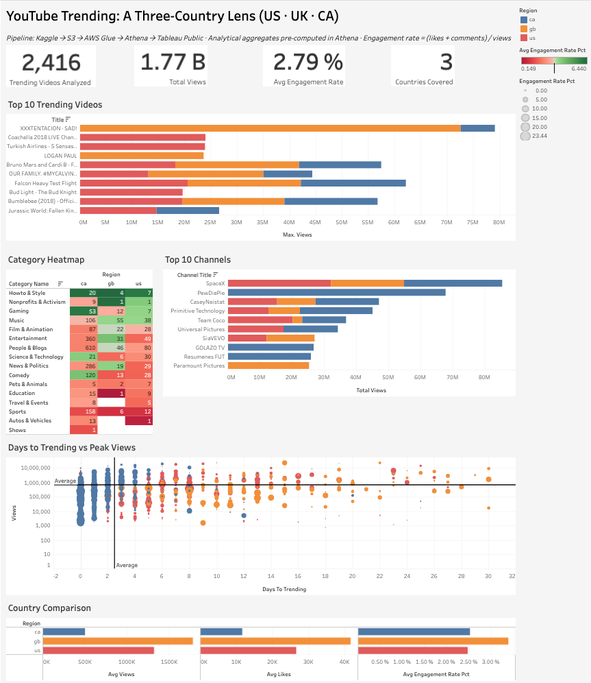

# What the dashboard reveals

The dashboard asks a simple question: how does YouTube trending behavior differ across the US, UK (GB), and Canada (CA)? It sits on top of 2,416 trending videos drawn from the Kaggle YouTube Trending dataset, representing roughly 1.77 billion total views and an average engagement rate of 2.79% (defined as `(likes + comments) / views`). The live view is hosted at [public.tableau.com/views/youtube-trending-three-country-lens](https://public.tableau.com/views/youtube-trending-three-country-lens/Dashboard1).

### UK trending pulls harder per video than US or CA

GB sits highest on every per-video metric in the country comparison: roughly 1.5M average views, ~40K average likes, and ~3.0% average engagement, versus ~2.5% for the US. This is consistent with a smaller, more concentrated trending shelf in the UK where each surfaced title gets more attention, rather than US-style breadth.

### Trending is a fast game, with a thin long tail

Most videos cross the trending threshold within 0–8 days of publish, with an average of roughly 2.5 days. Videos that take 10–30 days to trend cluster at noticeably lower peak views on the log-scale scatter, suggesting late-trending content rarely catches up to the early-trending tier.

### Cross-market virality concentrates in pop and spectacle

Six of the top 10 videos by peak views surface in all three markets, including Falcon Heavy Test Flight (~58M), Bruno Mars and Cardi B's "Finesse" (~57M), the Bumblebee trailer (~48M), and OUR FAMILY #MYCALVIN (~44M). The same pattern lifts SpaceX to the #1 channel slot at ~85M total peak views, suggesting a global pop and event-driven core that travels across national algorithms.

### Music is the most regionally balanced category

In the category heatmap, Music shows the most even split across regions (CA 106, GB 55, US 38) relative to other categories, where CA counts dominate by 5–10x. Read alongside the caveat below, Music still looks like the most globally-broadcast category in this corpus.

## Data caveats

CA has 3–10x more trending records than GB and US across most heatmap categories. This is almost certainly a data-volume artifact (the Kaggle CA file likely covered a longer window or denser daily snapshots) rather than a behavioral difference, so heatmap counts should be read as relative shape *within* a region, not *across* regions. The dashboard also scopes to 3 of the 10 countries in the Kaggle release and reflects a point-in-time refresh (daily cadence).

## Methodological note

Each row in `final_analytics` is one (video × trending day) snapshot, and YouTube view counts are cumulative; day 5 of trending already includes day 1's views. All peak metrics therefore use `MAX(views)` per video rather than `SUM`, which preserves the correct grain and avoids double-counting a single video's lifetime views across its trending days.
